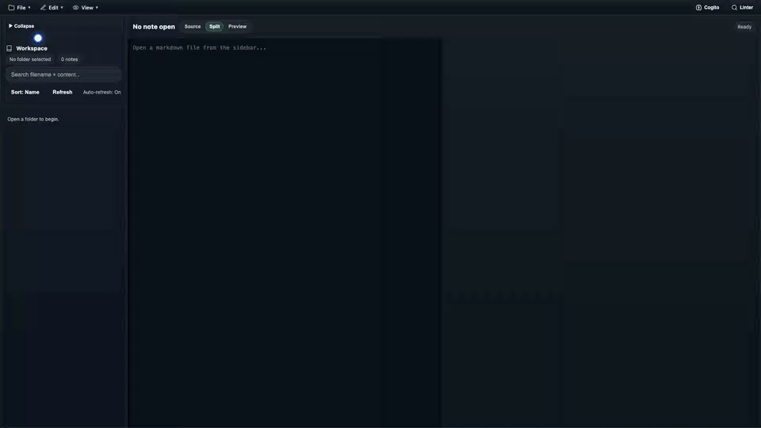

# ink

<p align="center">
  
</p>

Ink is a browser-based markdown workspace for writing notes and documents. It opens a local folder of `.md` files, shows a searchable file tree, renders a live preview, and exports temporary notes without needing a backend server.

The project goal is deliberately narrow: keep the writing surface fast, local-first, understandable, and easy to ship as one self-contained HTML file. Ink is not a hosted notes service, not a database-backed knowledge base, and not a replacement for a full IDE. It is a small document editor that can live next to your files.


[](https://opensource.org/licenses/MIT)

## Quick Demo



## What Ink Does

Ink provides the everyday loop for local markdown writing:

- Open a local folder as a workspace.
- Scan nested folders for `.md` files.
- Create markdown notes and folders.
- Edit markdown with source, split, or preview-only modes.
- Save changes back to the selected local file.
- Search across filenames and note contents.
- Filter notes by inline tags and frontmatter tags.
- Sort notes by name or modified date.
- Refresh manually or let idle auto-refresh rescan the workspace.
- Use temporary in-memory notes when the browser cannot provide folder access.
- Export temporary notes as JSON or the selected note as Markdown.
- Analyze document strength and generate local Cogito writing questions.
- Switch between built-in visual themes.

Ink keeps normal workspace notes in your folder as plain `.md` files. The main app has no server-side storage layer. Browser storage is used only for preferences, temporary model cache, and temporary-session behavior.

## Status

Ink is usable, but still a small evolving application. The current app is strongest for individual markdown folders and personal writing workflows.

Known boundaries:

- Workspace persistence depends on the browser File System Access API.
- Temporary sessions are in memory and must be exported before leaving the page.
- Cogito loads browser-side language models and may need network access, IndexedDB storage, and a capable browser/device.
- The final distributable is a generated file, `ink-app.html`; edit source files and rebuild rather than hand-editing generated output.

## Browser Support

For full local folder editing, use a Chromium-based browser with the File System Access API, such as Chrome or Edge.

When folder access is unavailable, Ink falls back to a temporary in-memory session. This mode is useful for mobile browsers, unsupported desktop browsers, or quick trials, but it cannot persist notes to your filesystem. Use the export commands before closing the tab.

The editor itself is a client-side web app. A built `ink-app.html` can be opened directly in a browser, hosted from static file hosting, or served locally during development.

## Getting Started As A User

If you only want to use Ink:

1. Open `ink-app.html` in a modern browser.
2. Choose `File -> Open Workspace`.
3. Select a folder that contains markdown files, or an empty folder where Ink can create them.
4. Allow read/write folder permission when the browser asks.
5. Choose `File -> New Note`, type a note name, and start writing.
6. Save with `Edit -> Save` or `Ctrl/Cmd + S`.

Ink reads `.md` files recursively. Files with other extensions are ignored by the workspace tree.

## Workspace Model

A workspace is a local directory handle selected through the browser. Ink stores the handle in memory for the current page session and requests read/write permission before scanning or saving.

The scan behavior is intentionally simple:

- Hidden files and folders whose names start with `.` are skipped.
- Only `.md` files are listed.
- Nested folders are shown as collapsible tree nodes.
- Note metadata is read from the first 256 KB of each file during scans.
- Folder scans read several files concurrently so large folders stay responsive.

Ink does not create an app-specific database for workspace notes. The markdown files remain normal files that can be edited with any other editor.

## Markdown And Tags

Markdown rendering uses `marked` and is configured with line breaks enabled. The preview updates as you type.

Tags are discovered from two places:

```markdown
---
tags: [draft, research]
---

# A tagged note

Inline tags like #idea and #writing are also recognized.
```

Frontmatter supports inline lists like `tags: [draft, research]` and block lists:

```yaml
---
tags:
  - draft
  - research
---
```

Tags are normalized to lowercase and shown as filter buttons in the workspace sidebar.

## Editor Views

Ink has three editor modes:

- `Source`: markdown editor only.
- `Split`: markdown editor and rendered preview side by side.
- `Preview`: rendered preview only.

The chosen mode is stored in `localStorage` under `ink-editor-view-mode`.

## Menus And Shortcuts

Ink uses a compact menu bar instead of a large toolbar. On macOS, shortcut hints use `Cmd`; on other platforms they use `Ctrl`.

| Action | Menu | Shortcut |
| --- | --- | --- |
| New note | `File -> New Note` | `Ctrl/Cmd + E` |
| New folder | `File -> New Folder` | none |
| Open workspace | `File -> Open Workspace` | `Ctrl/Cmd + Shift + O` |
| Close workspace | `File -> Close Workspace` | none |
| Export temporary notes as JSON | `File -> Export -> Export JSON` | `Ctrl/Cmd + Shift + S` |
| Export selected temporary note as Markdown | `File -> Export -> Export Markdown` | `Ctrl/Cmd + Shift + M` |
| Save current note | `Edit -> Save` | `Ctrl/Cmd + S` |
| Save as a new note | `Edit -> Save As...` | none |
| Refresh workspace | `Edit -> Refresh` | `Ctrl/Cmd + L` |
| Toggle sort mode | `Edit -> Sort` or sidebar `Sort` | none |

The sidebar also includes search, refresh, tag filters, note counts, and a collapse control.

## Temporary Sessions

Temporary sessions are enabled automatically when `showDirectoryPicker` is unavailable. They can also be triggered by agent-created notes before a workspace is open.

Temporary-session behavior:

- Notes exist only in browser memory.
- Folders are not supported.
- Save updates the in-memory note.
- Refresh is disabled because there is no filesystem to scan.
- `Export JSON` downloads all temporary notes.
- `Export Markdown` downloads the selected temporary note.

Use temporary sessions for quick drafting or unsupported browsers, but treat export as mandatory if the work matters.

## Cogito Writing Assistance

Cogito is the writing-assistance panel opened from the top-right `Cogito` button. It has two parts.

`Document strength` is deterministic analysis. It scores and explains clarity, structure, readability, engagement, and section-level priorities without using a language model. You can run it manually, enable rerun-on-change, navigate suggestions, and export a Markdown report.

`Improve with Cogito` generates exactly three question-only coaching prompts grounded in the latest sentence. If document analysis is available, Cogito uses a compact summary of strengths and priorities to focus those questions. Questions are not inserted automatically; each one has an explicit insert action.

Cogito model options:

- `Lite`: `Llama-3.2-1B-Instruct-q4f32_1-MLC`, the faster default.
- `Deep`: `Qwen3-8B-q4f16_1-MLC`, a larger model with fallback to Lite if model loading fails.

Cogito loads WebLLM in the browser from `https://esm.run/@mlc-ai/web-llm` and stores model data in IndexedDB. The core editor can still work without Cogito, but Cogito needs network access for first load and enough browser storage for the selected model.

## Themes

Ink ships with these themes:

- Default (Dark)
- Classic
- Cobalt
- Monokai
- Office
- Twilight
- Xcode

Theme selection is stored in `localStorage` under `ink-theme`.

## Agent Note Tool

The generated app includes a WebMCP-compatible note creation form. It is normally hidden and appears only when an agent uses the `create_note` tool. The tool accepts a title, body, and optional tag, then creates a markdown note in the active workspace or in a temporary session.

This keeps agent-created notes inside the same visible workflow as user-created notes.

## Installing For Development

Requirements:

- Node.js with npm.
- A modern browser for manual testing.
- Chrome or another Cypress-supported browser for end-to-end tests.

Install dependencies:

```bash
npm install
```

Build the app:

```bash
npm run build
```

The build writes `ink-app.html`, the single-file app with inlined CSS and JavaScript.

Watch and rebuild on source changes:

```bash
npm run watch
```

Serve locally for browser testing:

```bash
npm run serve:test
```

Then open:

```text
http://127.0.0.1:4173/ink-app.html
```

## Build System

Ink does not use a full app framework. The build pipeline is intentionally direct:

- TypeScript source is bundled with `esbuild`.
- SCSS is compiled with `sass`.
- `build/compile-and-assemble.js` assembles the final single-file app.
- `ink.template.html` provides the HTML shell.
- Generated CSS and JavaScript are injected into the template.
- Favicon assets are regenerated during the normal build.

Canonical build command:

```bash
npm run build
```

Makefile wrappers are available:

```bash
make lint
make build
make watch
make test
make test-qunit
make test-cypress
make repomix
```

## Testing

Automated tests cover pure utilities, app modules, browser workflows, and the generated build.

Run QUnit tests:

```bash
npm run test:qunit
```

Run Cypress end-to-end tests:

```bash
npm run test:cypress
```

Run the full suite:

```bash
npm test
```

The Cypress suite covers the main editor flow, workspace actions, menu behavior, mobile fallback behavior, editor view modes, document analysis, Cogito mode, and demo capture support.

## Demo Capture

Record the first-use flow:

```bash
npm run demo:record
```

This starts the local test server, launches headless Chrome, opens Ink, uses a fake workspace, creates `getting-started.md`, writes markdown, saves, and switches to preview. The recording is written to:

```text
assets/demo/ink-demo.webm
```

On macOS, when `avconvert` can convert the recording, the script also writes:

```text
assets/demo/ink-demo.mp4
```

Generate a GIF from the recorded video:

```bash
npm run demo:gif
```

This writes:

```text
assets/demo/ink-demo.gif
```

Keep the MP4 as the canonical demo artifact when possible because it is smaller and clearer than a full-app GIF.

## Repo Structure

```text
src/
  app.ts                       App entrypoint
  tags.ts                      Frontmatter and inline tag parsing
  app/
    app-controller.ts          Main composition root
    auto-refresh.ts            Idle workspace rescan behavior
    cogito.ts                  WebLLM-backed coaching questions
    document-linter/           Deterministic document analysis
    dom.ts                     Required DOM reference collection
    editor-preview.ts          Markdown preview and editor view modes
    fs-api.ts                  File System Access API helpers
    menu-actions.ts            Menu actions and shortcut labels
    sidebar.ts                 Sidebar collapse state
    toast-status.ts            Toast and status badge behavior
    tree-render.ts             Workspace tree, search, and tags
    ui-events.ts               Browser event wiring
    workspace-io.ts            Workspace, file, and temporary-session actions
  test-support/
    storage-fixture.ts         Test-only storage helpers
dist/
  app.min.js                   Generated bundled JavaScript
  styles.min.css               Generated bundled CSS
ink.template.html              Source HTML template
ink-app.html                   Final single-file app
build/
  compile-and-assemble.js      Canonical build entrypoint
  assemble-single-file.js      Assembly helper
  build-test.js                Test build helper
  generate-favicons.js         Branding asset generation
  record-demo.js               Browser demo recording
  export-demo-assets.js        Demo GIF export
  watch.js                     File watcher
assets/
  branding/                    Logo and favicon sources
  demo/                        Demo video and GIF assets
tests/
  qunit/                       Unit tests
cypress/
  e2e/                         End-to-end tests
openspec/
  project.md                   Project conventions and constraints
repomix-output.xml             AI-readable repo snapshot
```

## Branding Assets

Canonical logo:

```text
assets/branding/logo.svg
```

Generated favicon:

```text
assets/branding/favicon.svg
```

Regenerate favicon assets:

```bash
npm run build:favicon
```

The normal build also regenerates favicon assets before assembling `ink-app.html`.

## Working On The App

Use this loop for small changes:

1. Read `AGENTS.md`, `openspec/project.md`, and any relevant source/tests.
2. Edit source files under `src/`, `ink.template.html`, `assets/`, or `build/`.
3. Run the smallest relevant check.
4. Run `npm run build` before validating the generated app.
5. Run `npm test` for changes that affect user-facing behavior.

Do not hand-edit generated files unless the task is specifically about generated output. Prefer changing the source and rebuilding.

## Pre-Commit Repomix Hook

The project uses `repomix-output.xml` as an AI-readable snapshot of the repo. To keep it updated locally, install the pre-commit hook:

```bash
cp .git/hooks/pre-commit.sample .git/hooks/pre-commit 2>/dev/null || true
cat > .git/hooks/pre-commit << 'EOF'
#!/bin/sh
echo "Running repomix..."
npx repomix@latest
git add repomix-output.xml
EOF
chmod +x .git/hooks/pre-commit
```

You can also update it manually:

```bash
make repomix
```

## Troubleshooting

`Open Workspace` starts a temporary session.

Your browser probably does not support the File System Access API. Use Chrome or Edge for full local folder editing, or export your temporary notes before closing the tab.

The browser asks for folder permission again.

Folder permissions are browser-managed and may be revoked between sessions. Reopen the workspace and grant read/write access.

Files do not appear in the sidebar.

Ink only lists `.md` files and skips hidden paths that start with `.`. Use `Edit -> Refresh` after changing files outside Ink.

Search feels slow in a large folder.

Search checks filenames first and then file contents for scanned notes. Very large workspaces can take longer because content search reads matching candidates from disk.

Cogito fails to load.

Check network access, browser storage, and IndexedDB availability. The Deep model is larger; switch to Lite if storage or model download fails.

The app opens but cannot save.

Make sure the workspace was opened through `File -> Open Workspace` and that read/write permission was granted. Temporary sessions save only to memory.

Tests cannot start Cypress.

Use `npm run test:cypress:open` for interactive debugging, or confirm no environment variable is forcing Cypress into Electron's Node mode. The scripted test command unsets `ELECTRON_RUN_AS_NODE` before launching Cypress.

## License

Ink is released under the MIT License. See `LICENSE`.
